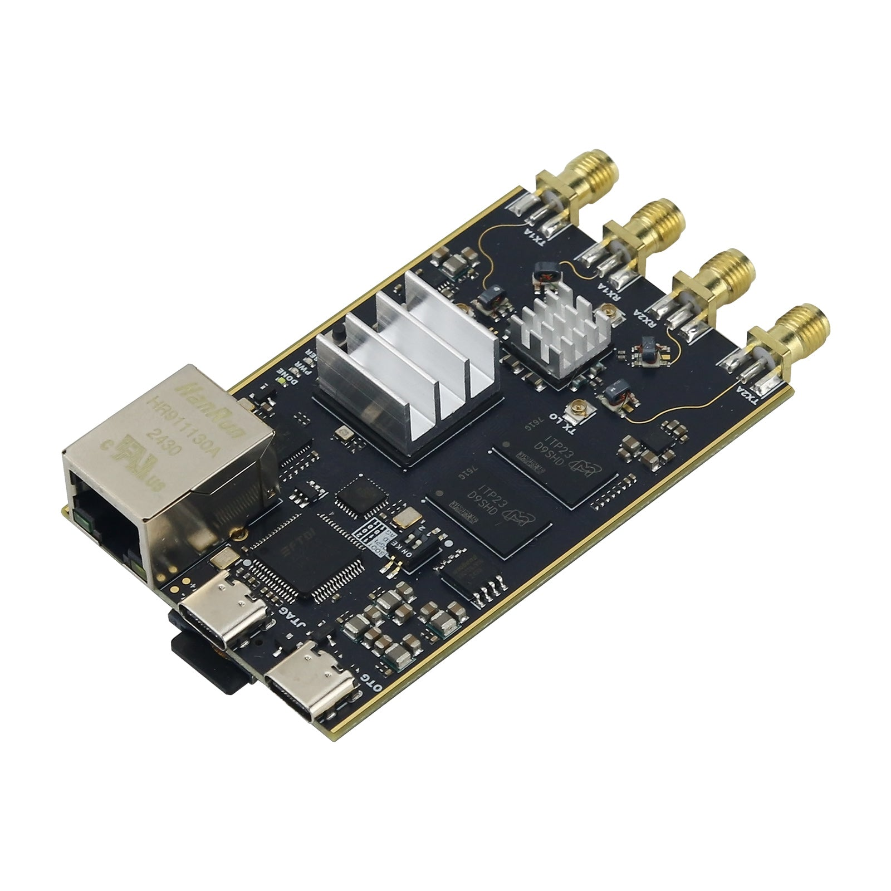
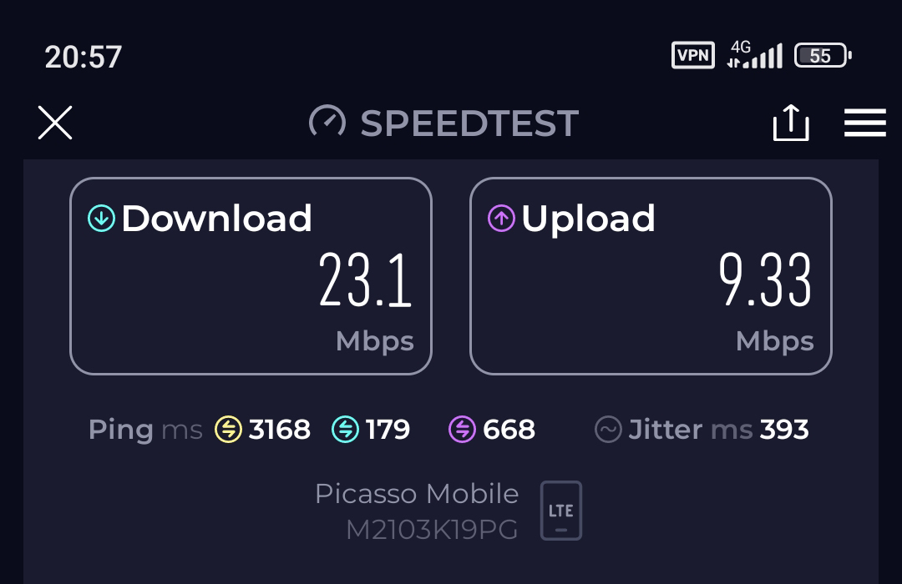

# FISH Ball SDR with Timestamping
Project is based on [Phil Greenland timestamping](https://github.com/pgreenland/plutosdr-fw/tree/v0.38_plutoplus_timestamp) and [FISH Ball SDR original firmware (Zynq7020+AD9363)](https://github.com/Xiaozhang-code-cloud/Fish-Wan-plutosdr-fw-7020-SDR)



## LTE Testing


*LTE Bandwidth 5 MHz, EARFCN 2525*

Ethernet Results (Full-Duplex 1000 Mbps)

| Bandwidth | 1.4 MHz | 3 MHz | 5 MHz | 10 MHz | 20 MHz | 
|-----------|---------|-------|-------|--------|--------|
| N_PRB | 6 | 15 | 25 | 50 | 100 |
| Samples | 1920 | 3840 | 5760 | 11520 | 23040 |
| Theoretical Transport Speed TX/RX, Mbps | 64/64 | 128/128 | 192/192 | 384/384 | 768/768 |
| Real Transport Speed TX/RX, Mbps | 64/64 | 128/128 | 192/192 | ❌ 365/320 | ❌ 700/430 |
| Speedtest DL/UL, Mbps | 4.5/1.5 | 15/5 | 23/9 | ❌ | ❌ |

*Transport Speed is the speed between PC and SDR*
**Limits:** At 10 and 20 MHz bandwidth the CPU utilization of the SDR board is 80-100%, which results is uneven transport speed. May be optimization of sdr_ip_gadget daemon will resolve this problem.

USB2.0 Results (Half-Duplex 480 Mbps)

| Bandwidth | 1.4 MHz | 3 MHz | 5 MHz |
|-----------|---------|-------|-------|
| N_PRB | 6 | 15 | 25 |
| Samples | 1920 | 3840 | 5760 |
| Theoretical Transport Speed TX/RX, Mbps | 64/64 | 128/128 | 192/192 |
| Real Transport Speed TX/RX, Mbps | 62/62 | 122/122 | ❌ 184/1 |
| Speedtest DL/UL, Mbps | 4.5/1.5 | 8.5/4 | ❌ |

**Limits:** At 5 MHz bandwidth USB2.0 limitations apply - the real speed is approximately 23 MB/s (184 Mbps).

## Power for SDR board

Power Supply 5V 1A (real measurement: ~5.4V ~0.8A), better use 1.5-2A.

## srsRAN

[Instruction](https://www.quantulum.co.uk/blog/private-lte-with-plutoplus-sdr/)

## Troubleshooting

If you see next logs in loop then UE reboot needs.
```bash
RACH:  tti=3531, cc=0, pci=1, preamble=24, offset=18, temp_crnti=0x58
Disconnecting rnti=0x58.
RACH:  tti=3611, cc=0, pci=1, preamble=33, offset=18, temp_crnti=0x59
Disconnecting rnti=0x59.
```

## Build

[Instruction](https://wiki.analog.com/university/tools/pluto/building_the_image)

The build requires Vivado and Vitis 2022.2.

```bash
sudo apt-get install git build-essential fakeroot libncurses5-dev libssl-dev ccache
sudo apt-get install dfu-util u-boot-tools device-tree-compiler libssl1.0-dev mtools
sudo apt-get install bc python cpio zip unzip rsync file wget
git clone --recursive https://github.com/analogdevicesinc/plutosdr-fw.git
cd plutosdr-fw
export VIVADO_SETTINGS=/opt/Xilinx/Vivado/2022.2/settings64.sh
make
make sdimg
```

Collect results in build directory and in addition a set of files for the sd card in build_sdimg folder. Copy the files inside the build_sdimg into a empty SD Card formatted as FAT32 and boot the SDR with the SD card. The default IP for connecting to SDR is 192.168.1.10.
